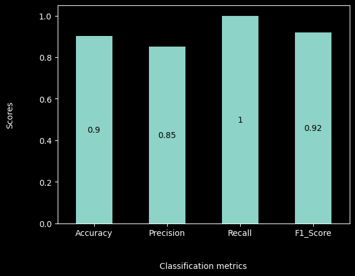

# **Heart Disease Prediction & Analysis**

The aim of this project is to utilize the *Cleveland heart disease* dataset to understand how medical attributes of a person contribute to heart-related diseases. We perform a detailed data analysis and create a machine learning model capable of predicting whether a person has heart disease or not, based on their medical attributes.

This is a binary classification task. Detailed explanations of the medical attributes are provided in the Jupyter [Notebook](./Heart-disease-model.ipynb).

This project is a milestone in the [Data Science/ML course](https://github.com/DarkDk123/ZTM-ML-Data-Science) by ZTM.

## Dataset

The dataset contains medical records of 303 patients collected during their follow-up period, with each patient profile having 13 clinical characteristics and a target variable indicating the presence of heart disease.

- Officially available at [UCI ML Repository](https://archive.ics.uci.edu/dataset/45/heart+disease).
- Also available in this repository [here](./dataCSV/heart-disease.csv).

### Attributes Information:

| Attribute          | Description                                                                                                                   |
| ------------------ | ----------------------------------------------------------------------------------------------------------------------------- |
| **Age**            | Age of a patient [years]                                                                                                      |
| **Sex**            | Gender of the patient [1: Male, 0: Female]                                                                                    |
| **ChestPain**      | Chest pain type [0: Typical Angina, 1: Atypical Angina, 2: Non-Anginal Pain, 3: Asymptomatic]                                 |
| **RestingBP**      | Resting blood pressure in mm Hg (Normal blood pressure - 120/80 Hg)                                                           |
| **Cholesterol**    | Serum cholesterol level in blood in mg/dL (Normal cholesterol level below for adults 200mg/dL)                                |
| **FastingBS**      | Fasting Blood Sugar (1 if > 120 mg/dL, 0 otherwise)                                                                           |
| **RestingECG**     | Resting electrocardiogram results [0: Normal, 1: ST-T wave abnormality, 2: Probable or definite left ventricular hypertrophy] |
| **MaxHR**          | Maximum heart rate achieved [Numeric value between 60 and 202]                                                                |
| **ExerciseAngina** | Exercise-induced angina [1: Yes, 0: No]                                                                                       |
| **Oldpeak**        | ST depression induced by exercise relative to rest                                                                            |
| **ST_Slope**       | The slope of the peak exercise ST segment [0: Upsloping, 1: Flat, 2: Downsloping]                                             |
| **CA**             | Number of major vessels (0-3) colored by fluoroscopy                                                                          |
| **Thal**           | Thallium stress test result [1, 3: Normal, 6: Fixed defect, 7: Reversible defect]                                             |
| **HeartDisease**   | Output class [1: heart disease, 0: Normal]                                                                                    |

Read more in the data dictionary in the Jupyter [Notebook](./Heart-disease-model.ipynb).

## Procedural Workflow

Here is an overview of the procedural steps performed throughout this project:

1. **Problem Definition**: Defining the objective of predicting heart disease.
2. **Data Collection & Exploratory Data Analysis (EDA)**: Gathering data and performing initial analysis.
3. **Data Preparation & Preprocessing**: Cleaning and preparing data for modeling. The data was already preprocessed.
4. **Model Selection, Training, and Validation**: Choosing appropriate models and validating their performance.
5. **Hyperparameter Tuning & Model Filtering**: Fine-tuning model parameters for optimal performance.
6. **Final Model Evaluation**: Evaluating the final model on the test dataset.
7. **Prediction and Interpretation**: Making predictions and interpreting the results.

## Performance Results

Our final model, evaluated on an unseen test dataset, yields considerable performance metrics:

